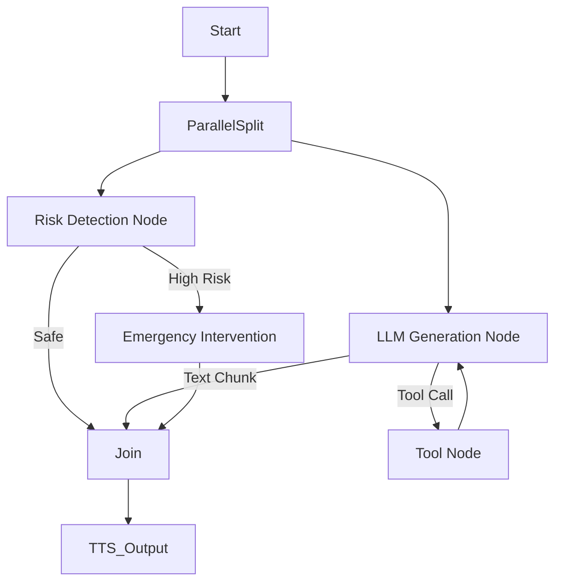

# Analysis of Xiaozhi Server & LangChain 1.0+ Migration Plan

## 1. Comprehensive Codebase Analysis

### 1.1 Project Structure
The `xiaozhi-server` is a Python-based WebSocket server designed for real-time voice interaction. It uses a "manual" agent implementation rather than a framework like LangChain.

**Key Components:**
*   **`core/connection.py`**: The central "brain" or "State Machine". It handles the WebSocket lifecycle, VAD (Voice Activity Detection), ASR (Speech-to-Text), LLM interaction, Tool execution, and TTS (Text-to-Speech).
*   **`core/providers/`**: A plugin-based architecture for swapping out implementations of:
    *   `llm/`: OpenAI, Ollama, Gemini, etc.
    *   `tts/` & `asr/`: Local and Cloud providers.
    *   `memory/`: `mem0ai` or local implementations.
    *   `tools/`: `UnifiedToolHandler` manages tools (IoT, MCP, Plugins).
*   **`core/utils/dialogue.py`**: Manages the chat history (`Message` objects).

### 1.2 Current Agent Implementation (Technical Analysis)
The agent logic resides primarily in `ConnectionHandler.chat()` within `core/connection.py`.

*   **Logic Flow:**
    1.  User audio -> VAD -> ASR -> Text.
    2.  `chat(query)` is called.
    3.  **Memory Retrieval:** Fetches context from `self.memory`.
    4.  **LLM Call:** Calls `self.llm.response()` (or `response_with_functions`).
    5.  **Streaming & Handling:**
        *   It manually parses the LLM stream.
        *   It detects `tool_calls` or specific string patterns (e.g., `<tool_call>`).
        *   It accumulates tokens.
        *   It performs "Optimistic Execution" (sending text to TTS while waiting for tools, though the current code prioritizes tools if present).
    6.  **Tool Execution:**
        *   If tools are detected, it pauses, executes the tool via `UnifiedToolHandler`, appends the result to history, and recursively calls `chat()` (recursion depth limited to 5).
    7.  **Output:** Generates TTS audio and sends it via WebSocket.

*   **Concurrency:** Heavy reliance on `asyncio` and `ThreadPoolExecutor` for non-blocking operations.
*   **State Management:** State (history, session ID, buffers) is held in the `ConnectionHandler` instance. One instance per WebSocket connection.

### 1.3 New Requirements Context
1.  **Real-time Psychological Risk:** Needs to analyze user input *before* or *during* the main response generation to trigger interventions.
2.  **Daily Summary:** Needs a persistent store of chat logs and a scheduled job (cron) to process them. The current `memory` module saves to a file or Mem0, but there's no obvious background scheduler for *offline* processing in the current code.

---

## 2. LangChain 1.0+ Comparison

LangChain has evolved significantly. Version 1.0 introduced LCEL (LangChain Expression Language) for production-grade stability, and **LangGraph** has replaced `AgentExecutor` for building complex agents.

| Feature | Current Implementation (`xiaozhi-server`) | LangChain 1.0+ (LangGraph/LCEL) |
| :--- | :--- | :--- |
| **Orchestration** | Manual `if/else` and recursion in `chat()` method. Hard-coded state management. | **LangGraph**: Graph-based state machine (Nodes & Edges). State is explicitly defined in a schema. |
| **Streaming** | Manual generator handling and string parsing. | **LCEL**: Standardized `.stream()`, `.astream()`, and `astream_events()` API. First-class support for token-by-token streaming. |
| **Tool Calling** | Manual JSON parsing and recursion loop. | Native support for OpenAI-style tool calling, output parsers, and standardized `ToolMessage` handling. |
| **Memory** | Custom `Dialogue` class + `mem0` integration. | `RunnableWithMessageHistory` or LangGraph `Checkpointers`. |
| **Flexibility** | High for low-level control, but modifying the "flow" (e.g., adding a safety check step) requires editing the giant `chat` function. | **High Compositionality**: Adding a "Psychological Check" node is just adding a node to the graph edges. |
| **Parallelism** | Manual `asyncio` tasks. | **LangGraph**: Parallel branches (e.g., running Risk Detection parallel to Response Generation) are a native feature. |

### 2.1 Pros & Cons of Current vs. LangChain

**Current (Manual):**
*   *Pros:* Complete control, no framework overhead, lightweight, optimized for specific ASR/TTS flow.
*   *Cons:* "Spaghetti code" in `chat()`, hard to add complex flows (like parallel risk detection), boiler-plate for every new LLM provider, difficult to debug state changes.

**LangChain 1.0+ (LangGraph):**
*   *Pros:*
    *   **Visualizable Flow:** The agent logic is a graph.
    *   **State Persistence:** Built-in checkpointers.
    *   **Ecosystem:** Instant access to 100+ integrations (Vector stores, Tools).
    *   **Parallelism:** Perfect for the "Psychological Risk" requirement (run risk check node in parallel).
    *   **Standardization:** Easier for other devs to understand than a 1000-line `connection.py`.
*   *Cons:* Learning curve, abstraction overhead (minor in Python), requires refactoring the "heart" of the server.

---

## 3. Feasibility & Feasibility Study

**Verdict: Highly Feasible and Recommended.**
The current `ConnectionHandler` is becoming a "God Object". Moving the logic to LangGraph will sanitize the architecture.

**Risks:**
1.  **Latency:** LangChain introduces a tiny overhead. For a real-time voice agent, every millisecond counts. *Mitigation:* Use LCEL efficiently, minimize chain depth, keep VAD/ASR/TTS outside LangChain (keep them in `connection.py`).
2.  **Migration Effort:** The `chat()` function is deeply coupled with TTS/ASR buffers. *Mitigation:* The "Agent" should be a pure logic component that takes text in and yields text/events out. `connection.py` stays as the I/O layer.

---

## 4. Proposed Architecture (LangChain 1.0 / LangGraph)

We will refactor `ConnectionHandler` to delegate the "Brain" to a **LangGraph** instance.

### 4.1 The "Graph" Design
Instead of a recursive `chat` function, we define a StateGraph.

**State Schema:**
```python
class AgentState(TypedDict):
    messages: Annotated[list[AnyMessage], add_messages]
    user_id: str
    risk_level: str # New feature
    summary: str
```

**Nodes:**
1.  **`guard_rail`**: (Parallel Node) checks for psychological risk.
2.  **`chatbot`**: Generates response (streaming).
3.  **`tools`**: Executes tools.
4.  **`summarizer`**: (Background) Runs daily summaries.

**Flow:**


### 4.2 Addressing New Requirements

#### Feature 1: Real-time Psychological Risk Intervention
*   **Implementation:** Create a separate `Runnable` (chain) specialized in sentiment/risk analysis.
*   **Integration:**
    *   In LangGraph, we run the `RiskChain` *in parallel* with the main `ChatChain`.
    *   If `RiskChain` flags "High Risk", we **interrupt** the `ChatChain` stream (or gate the output) and inject the intervention message.
    *   *Model:* Use a fast, smaller model (e.g., fine-tuned small model or specialized prompt on the main model) to classify: `Normal | Depression | SuicideRisk | Anxiety`.

#### Feature 2: Daily Periodic Summary
*   **Implementation:**
    *   The WebSocket server is real-time, it shouldn't run cron jobs for offline users.
    *   **Solution:** We need a separate thread or a lightweight task scheduler (e.g., `APScheduler`) running in `app.py` or a dedicated worker.
    *   **Logic:**
        1.  Iterate over active/recent user IDs from the storage.
        2.  Load chat history (LangChain `SQLChatMessageHistory` or similar).
        3.  Run a `MapReduce` summarization chain: "Analyze the user's psychological state change over the last 24h".
        4.  Store this in a `UserProfile` vector store or database.
        5.  Inject this `daily_summary` into the `SystemPrompt` of the next conversation.

### 4.3 Proposed Code Structure (Rewrite)

1.  **`core/agent/graph.py`**: Defines the LangGraph.
2.  **`core/agent/risk_model.py`**: The psychological risk detection chain.
3.  **`core/agent/scheduler.py`**: The `APScheduler` for daily summaries.
4.  **`core/connection.py`**:
    *   **Remove:** The complex `chat` logic, tool handling recursion.
    *   **Keep:** WebSocket, VAD, ASR, TTS integration.
    *   **Change:** `chat()` simply streams inputs into `agent_graph.astream()` and pipes events to TTS.

### 4.4 Transition Plan
1.  **Dependency:** Add `langchain`, `langgraph`, `langchain-openai`.
2.  **Refactor:** Create the `AgentGraph` class isolated from the server.
3.  **Integrate:** Instantiate `AgentGraph` inside `ConnectionHandler`.
4.  **Verify:** Test latency and tool calling accuracy.
