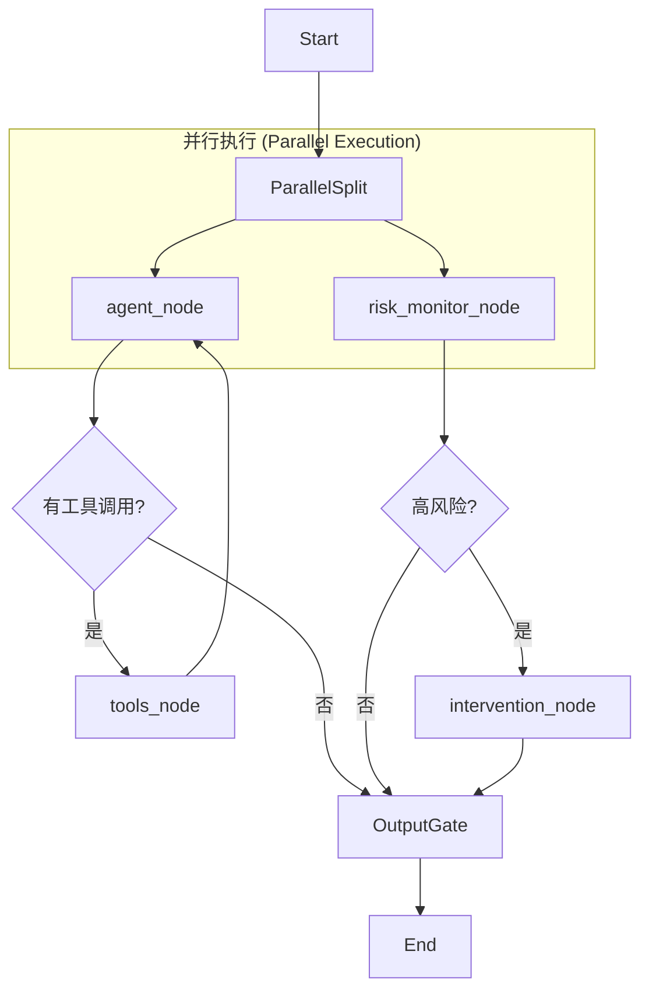

# 小智服务端 (XiaoZhi Server) LangChain 1.0+ 重构分析报告

## 1. 现有技术方案深入分析

通过全面阅读源代码（特别是 `main/xiaozhi-server/core` 目录），我们对现有架构有了深入理解：

### 1.1 核心逻辑 (`ConnectionHandler`)
项目的核心智能逻辑位于 `main/xiaozhi-server/core/connection.py` 中的 `ConnectionHandler` 类。
- **消息循环**：采用手动编写的事件循环。`handle_connection` 接收 WebSocket 消息，路由至 `_route_message`，最终调用 `chat` 方法。
- **状态管理**：状态分散在 `ConnectionHandler` 的实例变量中（如 `self.dialogue`, `self.sentence_id`, `self.client_is_speaking`）。
- **并发与流式**：
    - 使用 `asyncio` 和 `threading.ThreadPoolExecutor` 处理并发（如 TTS 合成、ASR 上报）。
    - 使用 Python 生成器 (`yield`) 手动处理 LLM 的流式输出。
    - **工具调用**：通过 `UnifiedToolHandler` 手动解析 LLM 输出的 JSON/XML 来触发工具，逻辑较为硬编码。
- **组件抽象**：`core/providers` 下虽然有抽象基类，但各个组件（LLM, Memory, TTS）的组合逻辑主要硬编码在 `ConnectionHandler` 中，耦合度较高。

### 1.2 局限性
- **扩展性瓶颈**：添加新的并行任务（如用户要求的“实时心理检测”）非常困难，需要在庞大的 `chat` 方法中插入逻辑，容易破坏现有的流式处理逻辑。
- **状态持久化弱**：目前的 Memory 模块虽然支持保存到文件/DB，但缺乏细粒度的“状态机”管理（Checkpointing），难以实现复杂的“时光倒流”或“断点续传”。

---

## 2. 与 LangChain 1.0+ 的对比分析

我们将现有方案与 LangChain 1.0+ (重点是 **LangGraph**) 进行对比：

| 特性 | 现有方案 (Current) | LangChain 1.0+ (LangGraph) |
| :--- | :--- | :--- |
| **架构模式** | 过程式 (Imperative)、单体大函数 | 图模式 (Graph-based)、节点化 (Modular Nodes) |
| **状态管理** | 隐式状态 (实例变量)，难以序列化 | **显式状态 (State Schema)**，原生支持持久化到 DB |
| **控制流** | 硬编码的 `if/else` 和递归调用 | **有向有环图 (DAG/Cyclic)**，支持条件边 (Conditional Edges) |
| **工具调用** | 手动解析字符串/JSON | 原生 **Tool Binding** (`bind_tools`)，标准化的工具执行节点 |
| **并行执行** | 需手动管理 `asyncio.gather`/`Task` | **原生并行节点** (如同时运行 Agent 和 风险监测) |
| **可观测性** | 仅依赖本地日志 | 可集成 **LangSmith**，通过 Trace 可视化整个链路 |

### 优缺点总结
- **现有方案优点**：完全掌控底层 Socket 读写，无第三方框架开销，极其轻量，延迟极低。
- **现有方案缺点**：业务逻辑与网络层耦合，维护成本随功能增加呈指数级上升。
- **LangChain 优点**：生态丰富，标准化，易于实现复杂的 Agent 模式（如 ReAct, Plan-and-Solve）。
- **LangChain 缺点**：引入了额外的抽象层，若不进行优化，可能会引入微小的延迟（通常 <10ms，可忽略）。

---

## 3. 重写可行性、收益及风险

### 3.1 可行性：**高**
项目使用标准的 Python 异步框架，LangChain/LangGraph 完美支持 `asyncio`。`ConnectionHandler` 中的逻辑可以被拆解为 Graph 中的不同 Node。

### 3.2 收益
1.  **解耦**：将网络层（WebSocket）与 业务层（Agent 逻辑）彻底分离。
2.  **新功能支持**：**LangGraph 的并行执行能力完美契合“实时心理风险识别”的需求。**
3.  **持久化**：利用 Checkpointer，天然支持“每日总结”所需的数据回溯能力。
4.  **调试**：利用 LangSmith 可以清晰看到 Agent 在何时决定调用工具，何时决定结束对话。

### 3.3 风险
1.  **延迟**：LangGraph 的状态读写可能会增加极少的延迟。对于实时语音对话，需要优化 Graph 的流式输出 (`astream_events`) 以确保 TTS 能及时收到首字。
2.  **重构成本**：`ConnectionHandler` 逻辑复杂，包含 ASR/TTS/VAD 的信号处理，重构时需小心保留这些信号处理逻辑，仅替换“决策/对话”部分。

---

## 4. 使用 LangChain 1.0+ 重写的思路与架构

### 4.1 核心架构设计 (LangGraph)

我们将构建一个**并行执行图**。

#### (1) 定义状态 (State)
```python
class AgentState(TypedDict):
    messages: Annotated[List[AnyMessage], add_messages] # 对话历史
    user_id: str
    risk_level: str          # 心理风险等级: low, high
    intervention_needed: bool # 是否需要干预
    sentiment_score: float   # 情感分数
```

#### (2) 图结构设计 (Graph Nodes)
*   **`agent_node`**: 主对话节点。调用 LLM 生成回复或工具调用。
*   **`risk_monitor_node`**: **(新增)** 专门的心理分析节点。输入用户消息，输出风险评估。
*   **`tools_node`**: 执行工具（天气、IoT控制等）。
*   **`intervention_node`**: **(新增)** 若检测到高风险，生成干预话术。

#### (3) 执行流 (Workflow)


### 4.2 针对新需求的实现方案

#### 需求 1: 实时识别心理风险并及时干预
**方案**：**乐观执行 (Optimistic Execution)**
*   **并行运行**：用户说话后，`agent_node`（主回复）和 `risk_monitor_node`（风险检测）同时启动。
*   **模型选择**：
    *   主 Agent 使用通用模型（如 gpt-4o）。
    *   风险监测使用**小参数、低延迟模型**（如 gpt-4o-mini 或 微调后的本地模型），专注于分类任务，确保速度快于主模型。
*   **干预机制**：
    *   **情况 A (无风险)**：直接流式输出 `agent_node` 的回复给 TTS。
    *   **情况 B (高风险)**：如果 `risk_monitor_node` 判定为高风险，系统触发 **Interrupt**（LangGraph 支持打断），丢弃 `agent_node` 的回复，转而播放 `intervention_node` 生成的专业引导语（例如：“我注意到你情绪很低落，我们可以聊聊吗？”）。

#### 需求 2: 定期总结用户心理状态 (每日凌晨 1 点)
**方案**：**LangGraph Persistence + 外部调度器**
1.  **持久化**：使用 `AsyncSqliteSaver` 或 Postgres 存储每个用户的会话状态 (`thread_id`)。
2.  **调度任务**：在 `app.py` 中添加一个 `apscheduler` 定时任务。
3.  **总结流程**：
    *   每日凌晨，遍历活跃用户的 `thread_id`。
    *   从 Graph Store 中拉取过去 24 小时的 `messages`。
    *   运行一个独立的 **Summarization Chain**（总结链）：
        *   输入：历史对话 + 昨日总结。
        *   Prompt：“分析用户今日的情绪波动、主要压力源，生成一份心理状态简报。”
        *   输出：更新到用户的 `LongTermMemory` 或存入数据库。
    *   **上下文注入**：次日用户交互时，Agent 读取这份“心理简报”，从而能够说出：“昨晚你睡得不好，今天感觉好点了吗？”

## 5. 总结
使用 LangChain 1.0+ (LangGraph) 重构 XiaoZhi Server 是**高度推荐**的。它不仅能以更优雅的方式解决现有的耦合问题，其原生的**图与并行执行能力**更是实现“实时心理干预”这一复杂需求的最佳技术选型。
