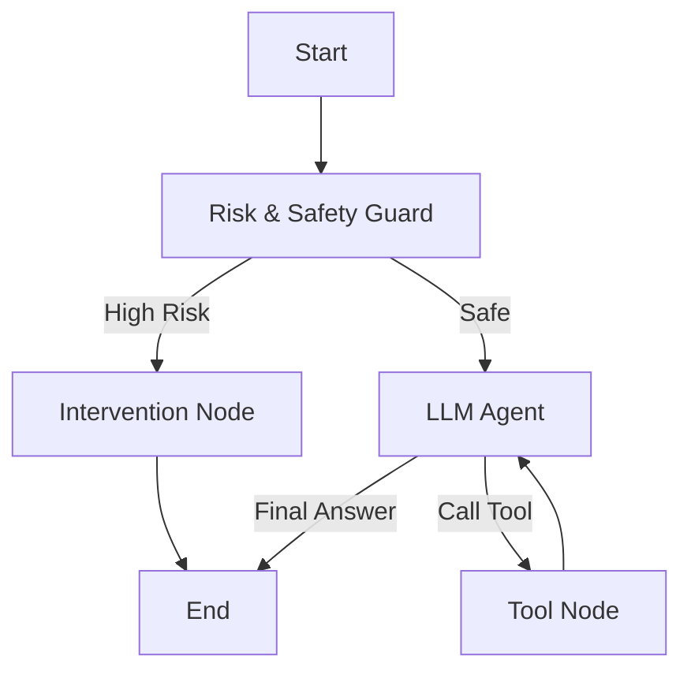

# Refactoring Analysis & Plan: Xiaozhi Server to LangChain 1.0+ (LangGraph)

## 1. Project Source Code Analysis (Python Backend)

The current `xiaozhi-server` is a Python-based WebSocket server that implements a conversational agent.

### 1.1 Core Architecture
- **Entry Point:** `app.py` initializes a `WebSocketServer` and manages the main asyncio event loop.
- **Connection Handling:** `core/connection.py` (`ConnectionHandler`) is the heart of the system. It manages the lifecycle of a single WebSocket connection.
- **Agent Loop:** The agent logic is implemented in `ConnectionHandler.chat`.
    - It uses **recursion** (`depth` parameter) to handle multi-turn tool execution (ReAct pattern).
    - **State Management:** State is scattered across instance attributes (`self.dialogue`, `self.client_is_speaking`, `self.session_id`) and method arguments.
    - **Message Flow:** Messages are routed via `_route_message` -> `handleTextMessage` -> `chat`.

### 1.2 Tool Handling (`UnifiedToolHandler`)
- Located in `core/providers/tools/unified_tool_handler.py`.
- **Mechanism:** It relies on **manual string parsing** (`extract_json_from_string`) to interpret LLM responses.
- **Vulnerability:** This approach is fragile. If the LLM produces malformed JSON or wraps it in unexpected text, the tool call fails. It does not leverage modern "Function Calling" APIs natively supported by providers like OpenAI.

### 1.3 Memory & Context
- **Session Memory:** `core/utils/dialogue.py` (`Dialogue` class) maintains the list of messages in RAM.
- **Long-term Memory:** `MemoryProviderBase` (`core/providers/memory/`) handles persistence. Saving is triggered asynchronously at the end of a session (`_save_and_close`).

---

## 2. Comparison: Current Implementation vs. LangChain 1.0+ (LangGraph)

| Feature | Current Implementation | LangChain 1.0+ (LangGraph) |
| :--- | :--- | :--- |
| **Orchestration** | **Manual Recursion**: `chat` calls `chat`. Hard to debug, potential stack overflow, complex state passing. | **StateGraph**: Nodes and Edges. Explicit control flow. Cyclic graphs naturally support ReAct loops. |
| **State Management** | **Implicit**: Variables scattered in `ConnectionHandler` class. | **Explicit**: `TypedDict` or Pydantic model (`AgentState`) passed between nodes. |
| **Tool Calling** | **Fragile**: Manual JSON parsing from string output. | **Robust**: `bind_tools` uses native LLM APIs (e.g., OpenAI Function Calling) with strict Pydantic validation. |
| **Persistence** | **Custom**: Manual hooks to save to vector DB/File. | **Built-in**: Checkpointers (`MemorySaver`, `AsyncSqliteSaver`) automatically save state at every step. Support "Time Travel". |
| **Streaming** | **Manual**: Custom generator handling and queue pushing. | **Standardized**: `astream_events` provides a unified API for token-by-token and event-by-event streaming. |
| **Observability** | **Logging**: Standard Python logging. | **LangSmith**: Native integration for tracing, replay, and evaluation. |

### 2.1 Key Differences
- **Control Flow:** LangGraph moves control flow from code (if/else/recursion) to a Graph topology.
- **Tooling:** LangChain abstracts the specific API differences between LLMs (OpenAI vs. Anthropic vs. Local), whereas the current code might need manual adapters.

---

## 3. Feasibility, ROI, and Risks

### 3.1 Feasibility: **High**
- The project is already in Python 3.10+, which is perfect for LangChain.
- The modular nature of `xiaozhi-server` (separation of `providers`) makes it easier to swap the internal logic of `ConnectionHandler` without breaking the WebSocket layer.

### 3.2 Benefits (ROI)
1.  **Stability:** Replacing manual JSON parsing with `bind_tools` will significantly reduce "Function Call Error" rates.
2.  **Extensibility:** Adding the requested "Psychological Risk" feature is trivial in a Graph (just add a Node). In the current recursive code, it requires hacking the `chat` method.
3.  **Observability:** Connecting to LangSmith will provide deep insights into agent latency and token usage.
4.  **Maintainability:** Decoupling the "Agent Logic" from the "WebSocket Connection Logic".

### 3.3 Risks
1.  **Latency:** LangChain introduces a slight overhead due to abstraction layers.
2.  **Migration Effort:** The `chat` method is tightly coupled with `tts` and `vad` logic. Refactoring requires carefully separating "Thinking" (LLM) from "IO" (Audio/WebSocket).

---

## 4. Refactoring Plan & Architecture

### 4.1 Proposed Architecture: `LangGraph`

We will replace the `chat` method logic with a compiled `StateGraph`.

#### State Schema
```python
class AgentState(TypedDict):
    messages: Annotated[List[BaseMessage], add_messages]
    risk_level: str
    user_profile: dict
    next_step: str
```

#### Graph Topology


### 4.2 Addressing New Requirements

#### Requirement 1: Real-time Psychological Risk Intervention
*   **Implementation:** Add a `Guardrails` node at the start of the graph.
*   **Mechanism:**
    *   This node runs a lightweight LLM call or a classification prompt *before* the main agent.
    *   **Prompt:** "Analyze the user's latest message for self-harm or high psychological risk. Return 'HIGH' or 'SAFE'."
    *   **Routing:** A `conditional_edge` checks `state['risk_level']`.
    *   **Intervention Node:** If High, this node generates a supportive, crisis-intervention response immediately, bypassing the standard persona tools.

#### Requirement 2: Periodic (Daily 1 AM) Summary
*   **Implementation:** Introduce `APScheduler` (Advanced Python Scheduler) in `app.py`.
*   **Data Access:**
    *   Since LangGraph uses **Checkpointers** (e.g., `AsyncSqliteSaver` or Postgres), the conversation state is persisted in a database.
    *   The background job does **not** need an active WebSocket connection.
*   **Workflow:**
    1.  Scheduler triggers at 01:00.
    2.  Query the Checkpoint DB for all users active in the last 24h.
    3.  Load their `AgentState`.
    4.  Run a separate "Summarization Chain" (not the main Agent Graph).
    5.  **Output:** Update the `user_profile` in the DB or push a "Morning Report" to the user's message queue.

### 4.3 Migration Steps

1.  **Environment:** Add `langchain`, `langgraph`, `langchain-openai`, `apscheduler`.
2.  **Tool Wrapping:** Wrap existing `UnifiedToolHandler` tools into LangChain `StructuredTool` objects.
3.  **Graph Construction:**
    *   Implement `RiskNode`.
    *   Implement `AgentNode` (using `bind_tools`).
    *   Implement `ToolNode`.
4.  **Integration:**
    *   In `ConnectionHandler`, initialize the Graph.
    *   In `chat()`, instead of recursion, call `await graph.ainvoke(inputs)`.
    *   Stream output from the graph to the existing `tts` queue.
5.  **Scheduler:** Add the background task in `app.py`.

### 4.4 Technical Challenges & Solutions
*   **Streaming TTS:** The current system relies on immediate text chunks for TTS. LangGraph's `.astream_events()` must be mapped to the `tts_text_queue` to ensure low latency.
*   **Context:** Ensure `Voiceprint` and `DeviceID` context is correctly passed into the `AgentState`.
