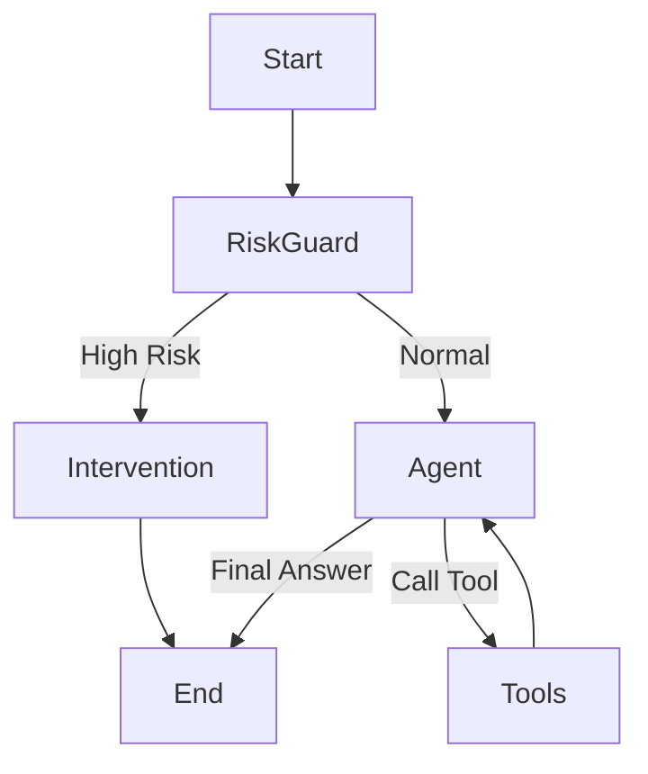

# Agent Project Refactoring Analysis & Proposal

## 1. 源代码及技术方案深入分析

经过对 `xiaozhi-server` 源代码的深入阅读（特别是 `core/connection.py`, `core/providers/tools/unified_tool_handler.py`, `core/providers/llm/base.py`），对现有 Agent 实现方案分析如下：

### 1.1 核心架构：Manual ReAct Loop
目前的 Agent 核心逻辑位于 `ConnectionHandler.chat` 方法中。
- **实现方式**：采用了一个手写的递归/循环结构来实现 "Reasoning + Acting" (ReAct) 模式。
- **流程**：
  1. 接收用户输入。
  2. 拼接历史对话（`Dialogue` 类）和 Prompt。
  3. 调用 LLM (`self.llm.response_with_functions`)。
  4. **手动解析** LLM 输出：通过字符串匹配 `<tool_call>` 或尝试解析 JSON 来识别工具调用。
  5. **执行工具**：调用 `UnifiedToolHandler` 执行工具。
  6. **递归**：将工具结果回填给 LLM，递归调用 `chat(depth=depth+1)`。
- **控制流**：通过 `depth` 参数控制最大递归深度（防止无限循环），硬编码了由 `MAX_DEPTH` 控制的终止条件。

### 1.2 工具管理：UnifiedToolHandler
- **实现方式**：自定义了一个复杂的 `UnifiedToolHandler`，负责聚合多种来源的工具（Server Plugins, MCP, IoT, Home Assistant）。
- **注册机制**：工具被手动转换为 schema 格式供 LLM 使用。
- **调用机制**：通过 `handle_llm_function_call` 分发调用，支持并行工具调用。

### 1.3 记忆与状态
- **短期记忆**：`Dialogue` 类在内存中维护了一个 List[Message]。
- **持久化**：依赖 `mem0ai` 或本地文件存储。
- **状态管理**：状态分散在 `ConnectionHandler` 的实例属性中（如 `client_is_speaking`, `sentence_id`, `intent_type`）。

---

## 2. 与 LangChain 1.0+ 的对比

| 特性 | 当前项目实现 (Xiaozhi) | LangChain 1.0+ (LangGraph) | 优缺点对比 |
| :--- | :--- | :--- | :--- |
| **Agent 循环** | **手动递归/While循环**。<br>代码耦合度高，流程控制（如暂停、人工介入、分支）难以扩展。 | **LangGraph (StateGraph)**。<br>基于图的状态机，节点(Node)和边(Edge)清晰定义流程。 | **LangGraph 优**：原生支持循环、分支、持久化状态、Time-travel（调试）。<br>**当前劣**：逻辑硬编码，难以维护复杂流程。 |
| **工具调用** | **手动解析字符串/JSON**。<br>容易出错，依赖 LLM 输出格式的稳定性。 | **`bind_tools` + Pydantic**。<br>利用模型原生 Tool Call API，自动验证参数类型。 | **LangChain 优**：标准化的接口，类型安全，自动错误处理。<br>**当前劣**：需维护大量正则/解析代码。 |
| **Prompt 管理** | **字符串拼接/替换**。<br>如 `core/utils/prompt_manager.py` 中的手动替换。 | **ChatPromptTemplate**。<br>结构化管理，支持 Partial 填充，易于复用。 | **LangChain 优**：更灵活的模板系统，支持多模态输入构建。 |
| **记忆管理** | **Custom Dialogue Class**。<br>手动维护 List，集成 mem0ai。 | **CheckpointSaver / Memory Store**。<br>图状态自动持久化，支持 Postgres/Redis 等后端。 | **LangChain 优**：开箱即用的状态持久化，天然支持 "Thread" 隔离。 |
| **可观测性** | **Logging + Print**。<br>难以追踪复杂的 Chain of Thought。 | **LangSmith**。<br>原生集成，可视化追踪每一步的耗时、Token、输入输出。 | **LangChain 优**：企业级可观测性，利于调试和评估。 |

---

## 3. 使用 LangChain 1.0 重写的可行性、收益及风险

### 3.1 可行性：高
- **语言兼容**：项目使用 Python 3.10，完全兼容 LangChain 最新版。
- **依赖隔离**：目前的 `LLMProvider` 和 `ToolHandler` 可以封装为 LangChain 的 `BaseChatModel` 和 `BaseTool`，无需重写底层逻辑。
- **架构映射**：当前的递归 `chat` 函数可以直接映射为 LangGraph 的标准 `Agent` 模式（Model -> ToolChecker -> ToolNode -> Model）。

### 3.2 收益
1.  **代码解耦与简化**：移除大量手动解析 JSON 和递归控制的代码，业务逻辑更清晰。
2.  **稳定性提升**：利用 LangChain 成熟的 OutputParser 和 Retry 机制，减少“幻觉”导致的格式错误。
3.  **扩展性增强**：新增功能（如“心理干预”）只需在图中增加一个 Node，无需侵入主逻辑。
4.  **生态集成**：更容易接入 LangSmith 进行调试，更容易集成社区的 Retriever 或 Tools。

### 3.3 风险
1.  **现有插件兼容性**：`UnifiedToolHandler` 支持多种异构工具（IoT, MCP），重写时需要编写 Adapter 将其转化为 LangChain Tool 格式。
2.  **WebSocket 流式输出适配**：LangChain 的 `astream_events` 与现有的 WebSocket 协议（Header+Audio流）需要进行细致的对接，避免延迟增加。
3.  **学习成本**：LangGraph 的概念（State, Reducer, ConditionalEdge）比简单的 Python 循环更抽象。

---

## 4. 重写思路、架构与难点方案

基于 LangChain 1.0+ (特别是 **LangGraph**) 的重构方案。

### 4.1 核心架构：LangGraph State Machine

不再使用 `ConnectionHandler` 中的递归，而是定义一个 `StateGraph`。

**State 定义**:
```python
from typing import TypedDict, Annotated, List, Union
from langchain_core.messages import BaseMessage
import operator

class AgentState(TypedDict):
    messages: Annotated[List[BaseMessage], operator.add]
    user_id: str
    risk_level: str  # 新增状态：心理风险等级
    summary: str     # 用户画像/总结
```

**图结构设计**:
1.  **Input Node**: 接收用户输入。
2.  **RiskGuard Node (新增)**: 实时心理风险检测。
3.  **Agent Node**: 调用 LLM (绑定了 Tools)。
4.  **Tools Node**: 执行工具 (ToolNode)。
5.  **Intervention Node (新增)**: 若高风险，触发干预话术。

**流程**:


### 4.2 关键功能实现方案

#### 需求 1: 实时心理风险识别与干预
*   **实现方案**：在主 Agent 生成回复之前，增加一个轻量级的 `RiskGuard` 节点。
*   **模型选择**：
    *   **低成本/低延迟**：使用微调过的 BERT 分类器或 `gpt-4o-mini` / `haiku` 等小模型，配合 Few-shot Prompt 进行二分类（High/Low Risk）。
    *   **Prompt 策略**：输入用户最近 N 轮对话，判断是否存在“自杀倾向”、“极度抑郁”等特征。
*   **LangGraph 实现**：
    ```python
    def risk_guard_node(state: AgentState):
        risk_score = risk_classifier.invoke(state["messages"][-1].content)
        return {"risk_level": risk_score.label}

    def route_risk(state):
        if state["risk_level"] == "HIGH":
            return "intervention"
        return "agent"
    ```

#### 需求 2: 定期总结用户心理状态 (每日凌晨 1 点)
*   **实现方案**：这是一个**异步后台任务**，与实时对话流分离。
*   **架构**：
    1.  **持久化存储**：使用 LangGraph 的 `PostgresCheckpointer` 或 SQLite，保存所有用户的历史会话 (`Checkpoints`)。
    2.  **调度器**：使用 `APScheduler` (现有依赖) 设置 Cron Job。
    3.  **总结工作流**：
        - 遍历活跃用户。
        - 加载过去 24 小时的 `messages`。
        - 调用 "Summary Agent" (专门的 Prompt) 生成心理状态报告。
        - 将报告更新到 `user_profile` 或通过 System Prompt 注入到第二天的对话中。
*   **代码片段思路**:
    ```python
    from apscheduler.schedulers.asyncio import AsyncIOScheduler

    async def daily_psych_summary():
        users = db.get_active_users()
        for user in users:
            history = db.get_chat_history(user.id, last_24h=True)
            summary = await summary_chain.ainvoke({"history": history})
            db.save_summary(user.id, summary)

    scheduler = AsyncIOScheduler()
    scheduler.add_job(daily_psych_summary, 'cron', hour=1)
    scheduler.start()
    ```

### 4.3 难点与应对
1.  **WebSocket 流式透传**：
    - LangChain 的 `astream_events` 生成的是 `OnChainStart`, `OnChatModelStream` 等事件。
    - 需要编写一个 `StreamAdapter`，将 `OnChatModelStream` 的 delta content 实时转换为 Xiaozhi 协议的 TTS 文本包，推送到前端。
2.  **工具迁移**：
    - `UnifiedToolHandler` 中的动态插件加载机制需要保留。
    - **方案**：编写一个 `DynamicToolFactory`，在系统启动时遍历 `UnifiedToolHandler` 的工具，动态生成 `StructuredTool` 对象列表，并在 `Agent Node` 运行时通过 `.bind_tools(tools)` 绑定。

### 4.4 总结
使用 LangChain 1.0+ (LangGraph) 重构不仅可行，而且是应对“心理干预”这种复杂状态流转的最佳实践。它将原本隐藏在递归代码中的业务流程显式化为图，极大地降低了维护成本，并为未来的多智能体协作打下基础。
