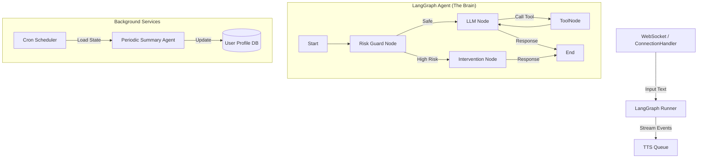

# Xiaozhi-Server Refactoring Analysis & Plan

## 1. Source Code & Technical Analysis (Current Implementation)

The current `xiaozhi-server` is a custom-built, asynchronous Python backend tailored for real-time voice interaction. It relies heavily on `asyncio` and `websockets` to manage stateful connections.

### Key Technical Components:
*   **Entry Point:** `app.py` initializes a `WebSocketServer`.
*   **Connection Management:** `core/websocket_server.py` creates a new `ConnectionHandler` for each WebSocket connection.
*   **State Management:** The `ConnectionHandler` (`core/connection.py`) is a monolithic class that manages:
    *   **Conversation History:** Via a custom `Dialogue` class (`core/utils/dialogue.py`).
    *   **Audio Pipelines:** Manages ASR (Automatic Speech Recognition) and TTS (Text-to-Speech) queues directly.
    *   **Agent Logic:** Contains a manual implementation of a ReAct (Reasoning + Acting) loop within the `chat()` method. It recursively calls itself to handle tool outputs.
    *   **Configuration:** deeply coupled with the server configuration.
*   **Tooling:** `UnifiedToolHandler` (`core/providers/tools/unified_tool_handler.py`) aggregates various tool sources (Plugins, MCP, IoT) and executes them. It manually parses JSON from LLM responses to trigger tools.
*   **Intent Handling:** `core/handle/intentHandler.py` provides a shortcut mechanism to handle specific intents (or exit commands) before engaging the full LLM chat loop.

### Characteristics:
*   **Pros:** Highly optimized for low latency; direct control over audio buffering and streaming; no external framework overhead.
*   **Cons:**
    *   **Coupling:** Agent logic is tightly intertwined with WebSocket I/O and Audio processing.
    *   **Scalability:** Adding complex agentic workflows (e.g., multi-step planning, reflection) requires modifying the monolithic `chat` loop, which is error-prone.
    *   **Maintenance:** Custom implementation of standard patterns (like Message History, Tool Binding) increases maintenance burden compared to using established libraries.

---

## 2. Comparison with LangChain 1.0+ (LangGraph)

LangChain 1.0 introduced significant stability changes, and the ecosystem now centers around **LangGraph** for building agents.

| Feature | Current `xiaozhi-server` | LangChain 1.0+ / LangGraph |
| :--- | :--- | :--- |
| **Agent Architecture** | **Monolithic Class (`ConnectionHandler`)**. State is scattered across instance variables. | **Graph-based (`StateGraph`)**. State is explicitly defined in a schema (e.g., `TypedDict`) and passed between Nodes. |
| **Control Flow** | **Recursion/Loops in Code**. Logic like "If tool call, do X, then recurse" is hardcoded in `chat()`. | **Nodes & Edges**. Control flow is defined as a graph. Conditional edges determine if the agent should call a tool or end. |
| **Tool Calling** | **Manual Parsing**. Uses regex/json parsing to extract tool calls and a custom loop to execute them. | **`bind_tools` & `ToolNode`**. Uses native LLM provider APIs for tool calling and standard nodes for execution. |
| **Memory/Persistence** | **In-Memory**. `Dialogue` list is kept in RAM. Saved to disk/DB only at the end of session. | **Checkpointers**. Native support for persisting state to databases (Postgres, SQLite) at every step, allowing "Time Travel" and easy resumption. |
| **Streaming** | **Custom Implementation**. Manages partial text chunks and feeds them to TTS. | **`stream_events`**. Standardized event streaming API (tokens, tool usage, state updates). |

### Differences & Latest Features (LangChain > 1.0)
*   **LangGraph:** The most critical difference. Instead of "Chains", we now use "Graphs". This allows for **Cyclic** flows (essential for agents) and fine-grained control over state.
*   **LCEL (LangChain Expression Language):** Declarative way to compose chains (`prompt | llm | output_parser`).
*   **Tool Calling:** Modern LLMs (GPT-4o, Claude 3.5) have native tool calling APIs. LangChain abstracts this cleanly, whereas the current code does manual JSON fix-ups.

---

## 3. Feasibility Study: Rewrite using LangChain 1.0

### Feasibility: **High**
The logic in `xiaozhi-server` maps very well to a Graph architecture.
*   **Input:** User Audio (transcribed to text).
*   **Processing:** LLM Logic -> Tool Execution -> Response.
*   **Output:** Text (sent to TTS).

### Benefits (ROI):
1.  **Decoupling:** Separates the *Agent Brain* (LangGraph) from the *Body* (WebSocket/Audio handling). This makes the agent testable in isolation.
2.  **Extensibility:** Adding the requested features (Psychological Risk, Periodic Summaries) is trivial in a Graph (just add a Node) but messy in the current `ConnectionHandler`.
3.  **Ecosystem:** Access to LangChain's massive library of tools, retrievers, and prompt templates.
4.  **State Persistence:** LangGraph's checkpointer solves the "Long-term Memory" and "Periodic Analysis" requirement out of the box.

### Risks:
1.  **Latency:** LangChain adds a slight abstraction layer. For real-time voice, every millisecond counts. We must ensure the graph execution is fast.
2.  **Migration Effort:** The `UnifiedToolHandler` supports custom plugins and MCP. These need to be wrapped as LangChain Tools.
3.  **Audio Streaming:** The current implementation pipes text tokens directly to TTS. We need to ensure LangChain's `astream_events` can feed the TTS queue with similar efficiency.

---

## 4. Rewrite Proposal: Architecture & Plan

We will replace the logic inside `ConnectionHandler.chat()` with a **LangGraph Agent**.

### A. New Architecture



### B. Detailed Components

#### 1. The Agent State
Define a clear schema for the conversation.
```python
class AgentState(TypedDict):
    messages: Annotated[list[AnyMessage], add_messages]
    user_profile: dict
    risk_level: Literal["safe", "low", "high"]
    session_id: str
```

#### 2. Feature: Real-time Psychological Risk Identification
*   **Implementation:** A specialized Node (`RiskGuard`) that runs *before* the main LLM.
*   **Model:** A fast, smaller model (e.g., `gpt-4o-mini` or a specialized prompt on the main model) classifies the user's input.
*   **Logic:**
    *   If `High Risk`: Route to `InterventionNode` (uses specific therapeutic prompts/scripts).
    *   Else: Route to `AgentNode` (normal chat).
*   **Why LangGraph?** conditional edges make this routing explicit and easy to visualize.

#### 3. Feature: Periodic User State Summary
*   **Implementation:**
    *   Use **LangGraph Checkpointer** (e.g., `AsyncSqliteSaver`) to persist every conversation turn.
    *   Create a separate **Background Worker** (using `APScheduler` or `Celery`).
    *   **Logic:** At 1:00 AM, the worker queries the DB for users active in the last 24h.
    *   It loads their state, passes it to a "Summarizer Agent", generating a psychological report.
    *   This report is saved back to `user_profile` in the DB, which the main agent reads in the next session.

#### 4. Wrappers for Existing Tools
We need to adapt `UnifiedToolHandler` to LangChain.
*   Create a class `XiaozhiToolAdapter` that wraps `func_handler.handle_llm_function_call` into a LangChain `StructuredTool`.

### C. Migration Steps

1.  **Dependency Update:** Add `langchain`, `langgraph`, `langchain-openai`.
2.  **Tool Adapter:** Write wrappers for existing plugins.
3.  **Graph Construction:** Implement `core/agent/graph.py`.
    *   Define `AgentState`.
    *   Create `call_model`, `call_tools`, `risk_guard` nodes.
    *   Compile the graph.
4.  **Integration:**
    *   Modify `ConnectionHandler`. Remove `self.dialogue` and `chat()`.
    *   Instantiate the LangGraph `CompiledGraph` in `__init__`.
    *   In `chat()`, instead of the manual loop, call `await self.graph.ainvoke(...)` or `astream_events`.
    *   Pipe the output tokens to `self.tts`.
5.  **Periodic Service:** Add `core/scheduler/summary_job.py` for the nightly analysis.

### D. Addressing the "Latest Features" Constraint
*   **Memory:** We will use `LangGraph`'s built-in `MemorySaver` (or Postgres) instead of the manual `_save_and_close` logic.
*   **RunnableConfig:** We will use `configurable` parameters to pass `session_id` and `user_id` thread-safely through the graph.
