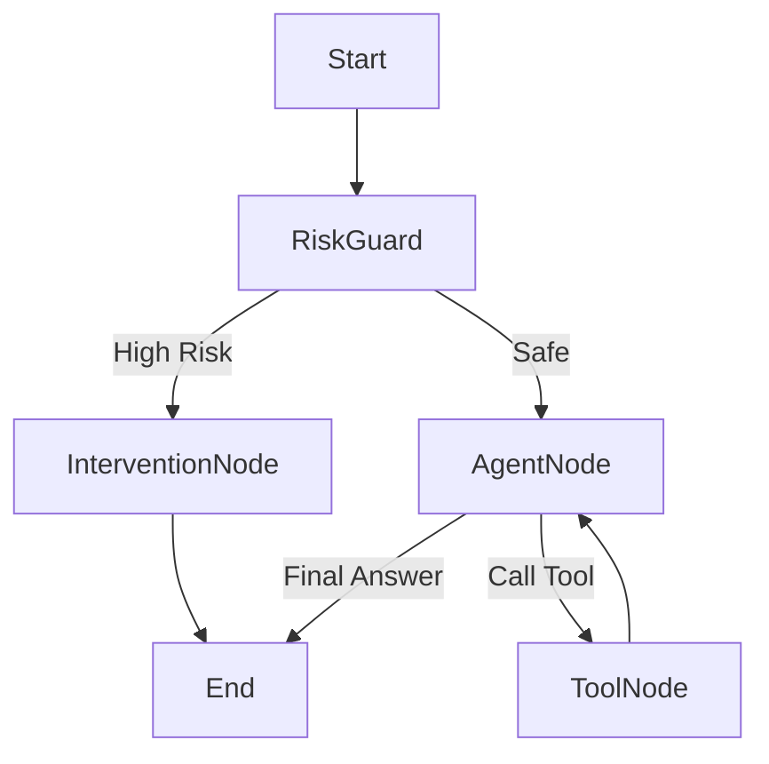

# Refactoring Plan: Migration to LangChain 1.0+ (LangGraph)

## 1. Analysis of Current Implementation

The current agent implementation resides mainly in `main/xiaozhi-server/core/connection.py` within the `ConnectionHandler` class.

### Key Characteristics:
*   **Orchestration:** The `ConnectionHandler` acts as a "God Object," managing WebSockets, Audio I/O (VAD, ASR, TTS), and LLM interaction in a single complex flow.
*   **State Management:** State is implicit, stored in `ConnectionHandler` instance variables (`self.dialogue`, `self.sentence_id`, etc.).
*   **Tool Execution:** Implemented via recursion (`chat` method calls itself with increased `depth`) and a `UnifiedToolHandler`. It parses raw JSON/XML from the LLM response manually.
*   **Concurrency:** A mix of `asyncio` (main loop) and `threading` (blocking I/O like audio processing/initialization).

### Limitations:
*   **Coupling:** Agent logic is tightly coupled with transport (WebSocket) and media processing.
*   **Observability:** Hard to trace the full chain of thought or intermediate states without verbose logging.
*   **Scalability:** Adding complex logic (like "Psychological Risk Assessment" before generation) increases the complexity of the `chat` method significantly, leading to "spaghetti code."
*   **Maintainability:** Manual tool parsing and recursive loops are error-prone compared to standardized graph flows.

## 2. Comparison: Current vs. LangChain 1.0+ (LangGraph)

| Feature | Current Implementation | LangChain 1.0+ (LangGraph) |
| :--- | :--- | :--- |
| **Architecture** | Linear/Recursive function calls inside a monolithic class. | Graph-based (Nodes & Edges). State flows between nodes. |
| **State** | Implicit (Class attributes). | Explicit (`TypedDict` State schema). |
| **Control Flow** | Hardcoded `if/else` and recursion. | Conditional Edges (e.g., `should_continue`, `check_risk`). |
| **Tooling** | Manual parsing and execution. | Standardized `ToolNode`, `bind_tools`, and `prebuilt` agents. |
| **Persistence** | Custom memory saving to disk/DB. | Built-in `Checkpointer` (sqlite, postgres) for pausing/resuming. |
| **Observability** | Logs (print/logger). | LangSmith integration (traces, latency, token usage). |

### Pros & Cons of Migration

**Pros:**
*   **Decoupling:** The "Agent" becomes a pure logic component, separating it from the WebSocket server.
*   **Flexibility:** Easy to insert new steps (e.g., `RiskGuard`) without breaking the main loop.
*   **Standardization:** Uses community-standard patterns (LCEL, Runnable) making it easier for new devs to onboard.
*   **New Features:** Easier to implement "Human-in-the-loop" (interruption) and complex multi-agent flows.

**Cons:**
*   **Migration Effort:** High. Requires rewriting the core `chat` loop and wrapping existing tools.
*   **Overhead:** Slight latency increase due to graph traversal (negligible for LLM apps).
*   **Dependency:** Adds a dependency on `langgraph`.

## 3. Feasibility and Risk

**Feasibility:** High. The current logic maps well to a StateGraph.
*   *Input:* Text (from ASR).
*   *Nodes:* `RiskGuard`, `LLM`, `ToolExecutor`.
*   *Output:* Text (to TTS).

**Risks:**
*   **Latency:** Real-time conversation requires low latency. LangGraph must be optimized (async nodes).
*   **Tool Compatibility:** Existing plugins/tools need to be adapted to LangChain `BaseTool` or compatible interfaces.
*   **Streaming:** The current `chat` method handles streaming token-by-token for TTS. LangGraph supports streaming (`astream_events`), but the WebSocket handler needs to be updated to consume this stream.

## 4. Proposed Architecture (LangGraph)

### Graph Structure

### Core Components

1.  **State (`AgentState`):**
    *   `messages`: List[BaseMessage]
    *   `user_profile`: Dict (Psychological state, history)
    *   `risk_level`: str (Safe, Low, High)

2.  **Nodes:**
    *   **`RiskGuard`:**
        *   *Input:* User message.
        *   *Logic:* Fast classification (Small LLM or Prompted 3.5/4o-mini). Checks for suicide, self-harm, depression indicators.
        *   *Output:* Updates `risk_level` in state.
    *   **`InterventionNode`:**
        *   *Condition:* Triggered if `risk_level` is High.
        *   *Logic:* Generates a supportive, empathetic response designed to de-escalate. Skips normal tool usage.
    *   **`AgentNode`:**
        *   *Logic:* Standard LLM processing (Bind tools).
    *   **`ToolNode`:**
        *   *Logic:* Executes mapped tools.

3.  **Real-time Risk Identification:**
    *   Implemented as the first node (`RiskGuard`).
    *   *Model:* Suggest using a lightweight model (e.g., `gpt-4o-mini` or a specialized local classifier) to minimize latency.
    *   *Prompt:* "Analyze the following user input for psychological distress. return JSON {risk: 'high/low', reason: '...'}"

4.  **Periodic User State Summary:**
    *   *Implementation:* Not part of the real-time graph. Separate **Scheduler Job** (using `APScheduler` or simple loop).
    *   *Frequency:* Daily (e.g., 1 AM).
    *   *Logic:*
        1.  Fetch conversation history from `Memory` for the last 24h.
        2.  Run a "Summarization Chain" (LangChain).
        3.  Update the `User Profile` / `Long-term Memory` (e.g., "User is feeling anxious about work").
        4.  This updated profile is injected into the `AgentState` for future conversations.

## 5. Migration Strategy

1.  **Dependencies:** Add `langchain`, `langgraph`, `langchain-openai` to `requirements.txt`.
2.  **Prototype:** Create `core/agent/graph.py` to define the graph.
3.  **Integration:** Modify `ConnectionHandler.chat()` to instantiate/call the Graph instead of the `while/recursion` loop.
    *   *Streaming Adapter:* Convert LangGraph stream events to the existing WebSocket message format.
4.  **Testing:** Verify latency and correctness of tool calls.
