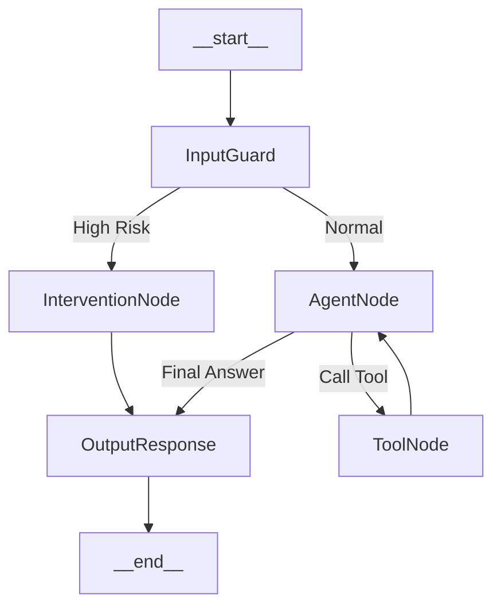

# 小智后端 (xiaozhi-server) 重构分析与 LangChain 1.0+ 迁移方案

## 1. 现有项目技术方案分析

通过深入阅读 `xiaozhi-server` 的源代码（特别是 `core/connection.py`, `core/websocket_server.py`, `core/handle/`），该项目目前采用的是 **基于 asyncio 的长连接状态机模式**。

### 核心架构特点：
1.  **连接即会话 (Connection-as-Session)**:
    *   `WebSocketServer` 接收连接后，为每个连接实例化一个 `ConnectionHandler`。
    *   所有的状态（对话历史 `Dialogue`、音频缓冲 `client_audio_buffer`、ASR/TTS 实例、工具处理器 `UnifiedToolHandler`）都保存在这个 `ConnectionHandler` 实例的内存中。
    *   生命周期：WebSocket 连接断开 -> 实例销毁 -> 触发 `_save_and_close` 保存记忆。

2.  **手动编排的 Agent 循环**:
    *   在 `ConnectionHandler.chat()` 方法中，开发者手动编写了类似 `ReAct` 的循环：
        *   接收 `query`。
        *   调用 LLM (`self.llm.response_with_functions`)。
        *   解析流式输出，判断是否包含 `<tool_call>` 或 Function Call 结构。
        *   执行工具 (`self.func_handler.handle_llm_function_call`)。
        *   递归调用 `chat(depth+1)` 将工具结果回传给 LLM。
    *   **优点**: 极度可控，针对流式输出（TTS 实时播放）做了高度优化。
    *   **缺点**: 逻辑耦合度极高，代码是个 "God Class" (2000+ 行)，难以扩展复杂的条件分支（如心理干预流程）。

3.  **IO 与 逻辑强耦合**:
    *   ASR（语音转文字）、VAD（语音活动检测）和 LLM 推理紧密交织在同一个类中。
    *   `send_tts_message` 等副作用直接散落在业务逻辑中。

---

## 2. 与 LangChain 1.0+ (LangGraph) 的对比

LangChain 1.0 引入了 **LangGraph**，这是专门为构建有状态、多角色的 Agent 设计的编排框架。

| 特性 | 当前方案 (`xiaozhi-server`) | LangChain 1.0+ (LangGraph) |
| :--- | :--- | :--- |
| **状态管理** | 隐式状态：分散在 `ConnectionHandler` 的实例变量中 (`self.sentence_id`, `self.dialogue`)。 | **显式状态 (State Schema)**：定义 `TypedDict`，所有节点共享且只能修改 Schema 中定义的变量。 |
| **控制流** | 硬编码的 `if/else` 和递归调用 (`chat` 调用自身)。 | **图 (Graph)**：使用 `Node` (节点) 和 `Edge` (边) 定义流程，支持条件跳转 (`Conditional Edge`)。 |
| **持久化** | 依赖内存，连接断开时通过 `Memory` 模块存文件/DB。 | **Checkpointer**：原生支持状态快照（Postgres/Redis），可随时暂停、恢复、回滚对话。 |
| **工具调用** | 手动解析 JSON/XML，手动映射函数，手动处理异常。 | **ToolNode**：标准化工具节点，自动绑定 LLM 的 `bind_tools`，自动处理执行与回传。 |
| **流式支持** | 针对 TTS 优化的定制流式处理。 | `astream_events` 提供标准事件流，但适配特定的 TTS 协议需要编写适配器。 |
| **可观测性** | 依赖 `logging` 打印日志。 | **LangSmith**：原生集成，可视化追踪每一步的输入输出、Token 消耗和耗时。 |

---

## 3. LangChain 1.0+ 重写可行性分析

### 可行性：**高**
*   **逻辑映射清晰**：当前的 `chat` 循环可以直接映射为 LangGraph 的 `prebuilt.create_react_agent` 或自定义 Graph。
*   **Python 生态兼容**：LangChain 原生支持 Python 3.10+，且依赖管理与现有项目冲突较小。

### 收益 (Pros)：
1.  **架构解耦**：将 "IO 处理" (WebSocket/ASR/TTS) 与 "Agent 逻辑" (决策/思考) 分离。IO 层只负责搬运数据，Graph 层负责状态流转。
2.  **功能扩展性**：新增 "心理风险检测" 只需在 Graph 中挂载一个并行节点或条件分支，无需修改主循环代码。
3.  **持久化与定时任务**：LangGraph 的 Checkpoint 机制使得 "定期总结" 功能极其容易实现（即使连接断开，状态依然存储在 DB 中）。
4.  **调试与监控**：接入 LangSmith 后，能够清晰看到 Agent 为什么选择这个工具，或者为什么没有检测到风险。

### 风险 (Cons) & 难点：
1.  **流式延迟 (Latency)**：LangChain 的抽象层会引入微小的延迟。对于实时语音交互（Real-time Audio），每一毫秒都很重要。需要使用 `astream_events` 并精细控制 buffer。
2.  **TTS 适配复杂度**：现有的 `ConnectionHandler` 在 LLM 生成第一个字时就开始 TTS 预取。在 LangGraph 中，需要确保 `LLM Node` 的流式输出能实时透传到 TTS 服务，而不是等节点执行完。
3.  **重构成本**：`ConnectionHandler` 包含大量针对硬件（ESP32）的特殊处理逻辑（如协议头、断连重连、设备绑定），这些逻辑不能丢弃，需要适配。

---

## 4. 基于 LangChain 1.0+ 的重构架构思路

### 4.1 总体架构设计

我们将系统拆分为两层：
1.  **Interface Layer (IO 层)**: 保持现有的 `WebSocketServer` 和 `ConnectionHandler` (瘦身版)。负责协议解析、ASR 音频流处理、TTS 播放。
2.  **Agent Core Layer (逻辑层)**: 基于 `LangGraph` 实现的 `StateGraph`。

### 4.2 LangGraph 图设计 (包含心理风险与总结)



#### 核心组件定义：

**State Schema:**
```python
from typing import TypedDict, Annotated, List, Union
from langchain_core.messages import BaseMessage
import operator

class AgentState(TypedDict):
    messages: Annotated[List[BaseMessage], operator.add]
    user_id: str
    risk_level: str  # 'normal', 'high'
    session_id: str
    summary: str     # 长期心理状态总结
```

### 4.3 关键功能实现思路

#### 功能一：实时心理风险识别与干预
**实现方案**：
在用户输入进入 LLM 之前，增加一个 **`RiskDetectorNode`**。

*   **模型选择**：为了低延迟，不建议使用主 LLM。
    *   *选项 A (高性能)*: 使用微调过的 BERT/RoBERTa 做文本分类 (HuggingFace Pipeline)。
    *   *选项 B (低成本)*: 使用轻量级 LLM (如 GLM-4-Flash, GPT-3.5-Turbo, 或者本地的小型模型) 并发调用进行判断。
*   **逻辑流程**：
    1.  用户语音转文字 (ASR) 完成。
    2.  文本传入 Graph。
    3.  `RiskDetectorNode` 并行分析文本情感倾向。
    4.  **Conditional Edge**:
        *   若 `risk_level == 'high'`: 路由到 `InterventionNode` (干预节点)，直接生成安抚话术，跳过普通对话逻辑，并标记 tag 触发人工/系统警报。
        *   若 `risk_level == 'normal'`: 路由到 `AgentNode` (正常对话)。

#### 功能二：定期心理状态总结 (每天凌晨 1 点)
**实现方案**：
利用 LangGraph 的 **Persistence (Checkpointer)** 和外部调度器 (Cron/APScheduler)。

1.  **数据持久化**：使用 `AsyncPostgresSaver` 或 `RedisSaver` 作为 LangGraph 的 checkpointer。所有的对话记录 (`messages`) 都会自动持久化。
2.  **独立 Worker**：创建一个独立的 Python 进程或线程运行调度器。
3.  **执行逻辑**：
    *   遍历活跃用户的 `thread_id`。
    *   加载该用户的最新 State (`graph.get_state(config)`).
    *   调用一个专门的 "Summary Graph" 或直接调用 LLM：
        *   Input: 过去 24 小时的 `messages` + 上一次的 `summary`。
        *   Prompt: "分析该用户今日的对话内容，提取心理状态变化，更新心理档案。"
    *   Output: 更新 `State` 中的 `summary` 字段。
    *   **辅助引导**: 将最新的 `summary` 注入到 System Prompt 中，第二天用户对话时，LLM 就能感知到"昨天他很低落"。

### 4.4 代码迁移重难点 (Refactoring Challenges)

1.  **流式透传 (Streaming Pass-through)**:
    *   **难点**: LangGraph 的节点通常是函数。要在节点内部实现 "Token 生成即发送 WS" 需要使用 `astream_events`。
    *   **解决**: 在 `ConnectionHandler` 中调用 `graph.astream_events`。监听 `on_chat_model_stream` 事件，一旦有 chunk 产生，立即放入 `tts_text_queue`。

2.  **工具上下文 (Tool Context)**:
    *   **难点**: 现有的工具 (IoT 控制) 可能需要访问 `ConnectionHandler` 里的变量 (如 `device_id`)。
    *   **解决**: 使用 `RunnableConfig` 传递运行时参数。
    ```python
    # 在 invoke/stream 时传入 config
    config = {"configurable": {"device_id": self.device_id, "connection": self}}
    graph.stream(inputs, config=config)
    ```
    工具内部通过 `config` 获取上下文。

3.  **ASR 中断与状态回滚**:
    *   **难点**: 用户打断 (Barge-in) 时，需要停止生成并丢弃未播放的音频。
    *   **解决**: LangGraph 本身是线性的。打断发生时，需要 `cancel` 当前的 `asyncio.Task`。由于 LangGraph 支持 Checkpoint，打断后的状态回滚比较容易（不保存此次中断的对话即可）。

## 5. 总结

使用 LangChain 1.0+ 重构是可行的，且对于实现 "心理风险监控" 和 "长期记忆总结" 具有极大的架构优势。建议采用 **渐进式重构**：
1.  **第一步**: 引入 `LangGraph` 依赖，定义 `StateSchema`。
2.  **第二步**: 将 `intentHandler.py` 和 `llm` 调用封装为一个简单的 Graph。
3.  **第三步**: 在 Graph 中加入 `RiskDetector` 节点。
4.  **第四步**: 配置 Postgres/Redis Checkpointer，实现持久化和定时总结任务。
5.  **第五步**: 逐步替换 `core/connection.py` 中的手动循环逻辑。
