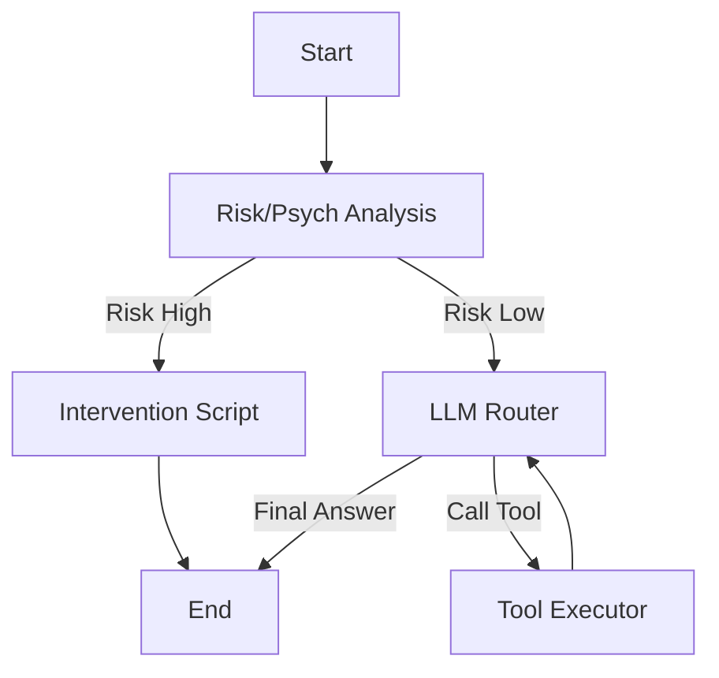

# Agent Refactor & Feature Implementation Plan (LangChain 1.0+ / LangGraph)

## 1. Codebase Analysis (Current Implementation)

### 1.1 Core Architecture
The current project (`xiaozhi-server`) implements a custom, WebSocket-based Voice Agent.
- **Entry Point:** `core/connection.py` -> `ConnectionHandler` class.
- **State Management:** State is held in instance variables of `ConnectionHandler` (e.g., `self.client_is_speaking`, `self.session_id`) and a custom `Dialogue` object (`core/utils/dialogue.py`).
- **Agent Loop:** The core logic is a **manual recursive function** `chat(query, depth=0)`.
    - It sends text to an LLM.
    - It parses the response stream manually for JSON-like tool calls.
    - If a tool is called, it executes it via `UnifiedToolHandler`, appends the result to history, and recursively calls `chat(None, depth+1)`.
    - Recursion is limited by a hardcoded `MAX_DEPTH`.
- **Tooling:** A custom plugin system managed by `UnifiedToolHandler` (`core/providers/tools/unified_tool_handler.py`). It supports local plugins, MCP (Model Context Protocol), and IoT devices.
- **Audio/IO:** The system is heavily integrated with audio streaming (`silero_vad`, `funasr`, `edge_tts`). Audio is processed in chunks, transcribed, and then passed to the `chat` method.

### 1.2 Limitations
- **Brittle Control Flow:** The recursive `chat` function mixes LLM interaction, response parsing, tool execution, and error handling in a single monolithic method.
- **Hard to Extend:** Adding complex logic (like "check for risk before answering" or "branch to a different sub-agent") requires hacking the `chat` function directly.
- **Non-Standard Abstractions:** The tool definition and execution are custom-built, missing out on the ecosystem standards provided by LangChain (e.g., standardized tool schemas, validation).

---

## 2. Comparison with LangChain 1.0+ (LangGraph)

| Feature | Current Implementation | LangChain 1.0+ (LangGraph) |
| :--- | :--- | :--- |
| **Control Flow** | Manual Recursion (`depth` param) | **StateGraph**: Explicit nodes and edges (Cyclic Graph). |
| **State Management** | Implicit (Instance attributes + `Dialogue` obj) | **StateSchema**: Explicit, typed dictionary (`TypedDict`) passed between nodes. |
| **Tool Calling** | Manual string parsing & execution | Native LLM Tool Calling (OpenAI/Anthropic standards) + `ToolNode`. |
| **Observability** | Custom logging (`config/logger.py`) | **LangSmith**: Built-in tracing, debugging, and evaluation. |
| **Flexibility** | Rigid "Chain of Thought" loop | Dynamic: Conditional edges, subgraphs, parallel execution. |

### 2.1 Why LangGraph?
LangChain 1.0 moved away from the "Chain" abstraction for agents and introduced **LangGraph**. LangGraph is designed specifically for building stateful, multi-actor applications with cyclic logic (like agents). It fits this project perfectly because an audio agent is inherently a state machine (Listening -> Thinking -> Speaking -> Listening).

---

## 3. Feasibility & ROI Analysis

### 3.1 Feasibility: **High**
- The current logic (`Input -> LLM -> Tool -> LLM -> Output`) is the definition of a standard ReAct agent, which is a solved problem in LangGraph.
- The `UnifiedToolHandler` can be wrapped. LangChain tools are just callables with a schema; we can create adapters for the existing plugins.
- Python 3.10 is already used, which is compatible with the latest LangChain ecosystem.

### 3.2 Benefits
1.  **Architecture Clarity:** Separates the "Brain" (Graph) from the "IO" (WebSockets/Audio).
2.  **Psychological Features:** Implementing "Risk Detection" becomes adding a single **Node** in the graph before the agent execution.
3.  **Ecosystem:** Access to thousands of community tools and easy switching between LLM providers (via LangChain's unified interface).
4.  **Resilience:** LangGraph supports "persistence" (checkpointing), allowing the agent to crash and resume exactly where it left off (useful for long-running sessions).

### 3.3 Risks
1.  **Latency:** LangChain introduces slight overhead compared to raw API calls. For a real-time voice agent, every millisecond counts. *Mitigation: Use `astream_events` to stream tokens immediately to TTS.*
2.  **Streaming Complexity:** The current system relies heavily on streaming. The rewrite must ensure the Graph outputs can be streamed token-by-token to the TTS engine without buffering the whole sentence.

---

## 4. Proposed Architecture (LangGraph Rewrite)

### 4.1 The Graph Structure
Instead of `ConnectionHandler.chat`, we define a `StateGraph`.

**State Schema:**
```python
class AgentState(TypedDict):
    messages: Annotated[List[BaseMessage], add_messages]
    user_id: str
    risk_level: str  # "low", "medium", "high"
    sentiment: str
```

**Nodes:**
1.  **`guardrail_node` (New Feature):** Analyzes the latest user input for psychological risk.
2.  **`agent_node`:** Calls the LLM to decide on actions or response.
3.  **`tools_node`:** Executes tools (wrapping `UnifiedToolHandler`).
4.  **`intervention_node` (New Feature):** Specialized response logic if risk is high.

**Flow:**


### 4.2 Feature Implementation Details

#### Feature 1: Real-time Psychological Risk Detection
*   **Requirement:** Identify high-risk states immediately and intervene.
*   **Implementation:**
    *   **Model:** Use a lightweight classification model (e.g., a distilled BERT fine-tuned on safety/sentiment) or a very fast, small LLM (e.g., `gpt-4o-mini` or a local quantization) with a specific "Safety System Prompt".
    *   **Integration:** This runs in the `guardrail_node`.
    *   **Action:** If `risk_score > threshold`, the graph branches to `intervention_node`. This node bypasses the standard persona and uses a strict, empathetic "Crisis Counselor" prompt.

#### Feature 2: Periodic (Daily 1 AM) User State Summary
*   **Requirement:** Analyze history daily to guide future interactions.
*   **Implementation:**
    *   **Mechanism:** This **cannot** be inside the real-time WebSocket loop. It requires an external scheduler (e.g., `APScheduler` or `Celery`).
    *   **Storage:** The system already uses `MemoryProvider`. We need to ensure chat logs are persisted to a queryable database (SQLite/Postgres) rather than just in-memory context.
    *   **Workflow:**
        1.  Scheduler triggers at 01:00.
        2.  Fetch chat logs for the last 24h for `user_id`.
        3.  Run a LangChain "Summarization Chain" (Map-Reduce or Refine document chain).
        4.  **Output:** Update the `User Profile` (stored in DB/Memory).
        5.  **Effect:** The next time the user connects, the `agent_node` loads this "Daily Summary" into its system prompt context.

### 4.3 Migration Plan

1.  **Dependency Update:** Add `langchain`, `langgraph`, `langchain-openai` (or other providers) to `requirements.txt`.
2.  **Tool Adapter:** Create a `LangChainToolAdapter` class that wraps the existing `UnifiedToolHandler.tool_manager.execute_tool` method into a standard `BaseTool`.
3.  **Graph Construction:** Create `core/agent_graph.py` to define the StateGraph described above.
4.  **Integration:**
    *   Modify `ConnectionHandler.handle_connection`.
    *   Replace `self.chat()` with `agent_graph.ainvoke()` (or `astream`).
    *   Map the graph output back to `self.tts`.
5.  **Add Features:** Implement the Guardrail node and the Scheduler.

### 4.4 Example Code Snippet (Concept)

```python
# core/agent_graph.py

from langgraph.graph import StateGraph, END
from typing import TypedDict, Annotated, List
from langchain_core.messages import BaseMessage

class AgentState(TypedDict):
    messages: List[BaseMessage]
    risk_level: str

async def risk_guardrail(state: AgentState):
    last_msg = state["messages"][-1].content
    # ... call risk model ...
    risk_level = "low" # placeholder
    return {"risk_level": risk_level}

async def agent(state: AgentState):
    # ... call LLM ...
    return {"messages": [response]}

def route_risk(state: AgentState):
    if state["risk_level"] == "high":
        return "intervention"
    return "agent"

workflow = StateGraph(AgentState)
workflow.add_node("guardrail", risk_guardrail)
workflow.add_node("intervention", intervention_node)
workflow.add_node("agent", agent)
workflow.add_node("tools", tool_node)

workflow.set_entry_point("guardrail")
workflow.add_conditional_edges("guardrail", route_risk)
workflow.add_edge("intervention", END)
workflow.add_conditional_edges("agent", should_continue)
workflow.add_edge("tools", "agent")

app = workflow.compile()
```
