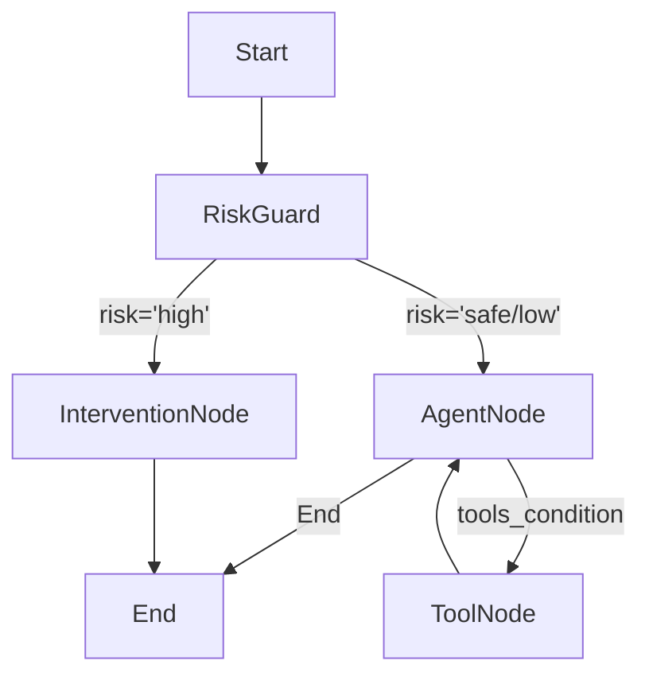

# XiaoZhi Agent Refactor Proposal & Analysis

## 1. 现有技术方案深度分析

通过深入阅读源代码（特别是 `core/connection.py`, `core/providers/tools/unified_tool_handler.py`, `core/providers/memory/base.py`），对当前 `XiaoZhi` 项目的 Agent 实现机制分析如下：

### 1.1 核心架构：手动 ReAct 循环
当前 Agent 的核心逻辑位于 `ConnectionHandler.chat` 方法中。
*   **实现方式**：采用**递归调用**配合**手动状态管理**来实现 ReAct（Reasoning and Acting）模式。
*   **流程**：
    1.  接收用户输入。
    2.  调用 LLM (`self.llm.response_with_functions`)。
    3.  解析 LLM 返回的字符串，手动提取 JSON 格式的 tool calls (`extract_json_from_string` 和 `_merge_tool_calls`)。
    4.  如果存在工具调用，通过 `UnifiedToolHandler` 执行工具。
    5.  将工具执行结果回填到 `self.dialogue`。
    6.  递归调用 `chat(depth=depth+1)` 进行下一轮推理。
*   **控制流**：通过 `depth` 参数防止无限递归，通过 `tool_call_flag` 等布尔标志控制流程分支。

### 1.2 工具调用 (Tool Usage)
*   **实现**：`UnifiedToolHandler` 是一个复杂的聚合层，它统一了 `Plugin`、`MCP` (Model Context Protocol) 和 `IoT` 设备调用。
*   **问题**：工具的描述构建、参数解析和执行逻辑高度耦合。LLM 输出的解析依赖于正则或字符串查找（`extract_json_from_string`），这在 LLM 输出不标准 JSON 时容易出错。

### 1.3 状态与记忆 (State & Memory)
*   **会话状态**：保存在 `ConnectionHandler` 实例的 `self.dialogue` 属性中，生命周期通常绑定在 WebSocket 连接上。
*   **长期记忆**：通过 `MemoryProviderBase` 抽象，支持 `mem0ai` 或本地摘要记忆。记忆的读写是在 `chat` 流程的开头（查询）和连接关闭/异常时（保存）进行的。

---

## 2. 与 LangChain 1.0 (LangGraph) 的对比

LangChain 1.0 引入了 **LangGraph**，这是专门为构建 Agent 设计的框架。

| 特性 | 当前 XiaoZhi 实现 | LangChain 1.0 (LangGraph) | 优缺点对比 |
| :--- | :--- | :--- | :--- |
| **控制流** | **隐式/代码级**：逻辑分散在 `chat` 方法的 `if/else` 和递归中。难以直观看出 Agent 的状态流转。 | **显式/图结构**：使用 `StateGraph` 定义 `Nodes` (节点) 和 `Edges` (边)。逻辑可视化，易于调试。 | LangGraph 可维护性更高，支持复杂的循环和条件跳转。 |
| **状态管理** | **对象属性**：`self.dialogue` 等散落在 `ConnectionHandler` 中，且容易在并发修改时出现竞态条件。 | **State Schema**：定义明确的 `TypedDict` 或 Pydantic 模型（如 `messages` 列表）。状态是不可变的，每次状态流转产生新状态。 | LangGraph 的状态管理更健壮，天然支持“时光倒流”和调试。 |
| **工具调用** | **手动解析**：依赖 `extract_json_from_string`，脆弱且对模型指令遵循能力要求高。 | **Native Binding**：利用 `bind_tools` 直接对接模型 API (OpenAI Tools, etc.)，使用标准 `ToolNode` 执行。 | LangChain 利用模型原生能力，解析更精准，容错率高。 |
| **持久化** | **手动实现**：需自行编写 `save_memory` / `query_memory` 并在特定时机调用。 | **Checkpointer**：内置持久化层 (Postgres, Sqlite)，自动保存每一步的状态快照。 | LangGraph 支持断点续传（Human-in-the-loop）和自动会话保持。 |

---

## 3. 重写可行性、收益与风险

### 3.1 可行性：高
*   **环境**：Python 3.10 完全支持 LangChain/LangGraph 的最新特性。
*   **模型**：项目已对接 OpenAI/DashScope 等标准接口，LangChain 有完善的适配器。

### 3.2 收益
1.  **代码解耦**：将复杂的 `ConnectionHandler` 拆解为多个独立的 Node（如 `RiskDetectionNode`, `AgentNode`, `ToolNode`）。
2.  **扩展性**：新增“心理风险识别”只需在图中插入一个节点，无需侵入核心循环逻辑。
3.  **稳定性**：利用社区验证过的 OutputParser 和 ToolBinding，减少 JSON 解析错误。
4.  **调试能力**：LangSmith 集成可以可视化追踪 Agent 的每一步思考过程。

### 3.3 风险
1.  **依赖冲突**：
    *   **关键点**：`requirements.txt` 中锁定 `websockets==14.2` (因 `cozepy` 限制)。LangChain 核心库通常不强绑定 websocket 版本，但需注意 `langchain-community` 中某些特定工具的依赖。需在重构前进行依赖测试。
2.  **工具迁移成本**：
    *   现有的 `UnifiedToolHandler` 处理了 MCP 和 IoT 逻辑。需要编写适配器（Wrapper），将这些现有执行器封装为 LangChain 的 `BaseTool` 子类，以便 `bind_tools` 使用。

---

## 4. 重构方案与架构设计

### 4.1 核心架构 (LangGraph)

我们将原来的 `chat` 递归重构为一个 `StateGraph`。

**State 定义**:
```python
class AgentState(TypedDict):
    messages: Annotated[list[AnyMessage], add_messages]
    risk_level: str  # 'safe', 'low', 'high'
    user_id: str
```

**图拓扑结构**:


#### 节点说明：
1.  **RiskGuard (新增需求)**：
    *   **功能**：实时心理风险识别。
    *   **实现**：使用轻量级模型（或主模型的小参数版本/专门的Prompt）快速扫描用户输入的 `last_message`。
    *   **输出**：更新状态中的 `risk_level`。
2.  **AgentNode**：
    *   **功能**：核心对话与工具决策。
    *   **实现**：调用绑定了工具的 LLM。
3.  **ToolNode**：
    *   **功能**：执行工具。
    *   **实现**：封装现有的 `UnifiedToolHandler` 为 LangChain Tools。
4.  **InterventionNode (新增需求)**：
    *   **功能**：高风险干预。
    *   **实现**：加载特定的心理干预 Prompt，不使用普通工具，直接引导用户并通知管理员（可通过回调函数实现）。

### 4.2 每日凌晨心理状态总结 (新增需求)

由于 `ConnectionHandler` 是基于 WebSocket 连接的，连接断开后对象可能被销毁。因此，“每日总结”不能依赖于实时的连接对象，而必须依赖于**持久化存储**。

**架构设计**：
1.  **持久化层**：引入 `AsyncSqliteSaver` 或 `PostgresSaver` 作为 LangGraph 的 checkpointer。所有的对话记录（State）都会自动存入数据库。
2.  **调度器**：在 `app.py` 中集成 `APScheduler`。
3.  **任务逻辑 (Daily Job)**：
    *   **Trigger**：每天凌晨 01:00。
    *   **Action**：
        1.  从数据库中遍历所有活跃用户的 `checkpoint`。
        2.  提取过去 24 小时的 `messages`。
        3.  运行一个独立的 LangChain Chain：`SummaryChain` (Input: History -> Output: Psychological Report)。
        4.  将生成的报告存入 `Memory` (作为长期记忆的一部分) 或推送到管理端。

### 4.3 难点攻克
1.  **MCP/IoT 工具封装**：
    *   需要创建一个通用的 `LangChainToolWrapper` 类，它接受 `UnifiedToolHandler` 中的函数描述和回调，并在 `_run` 方法中桥接调用。
2.  **流式输出 (Streaming)**：
    *   LangGraph 支持 `astream_events`。前端 WebSocket 需要适配 LangChain 的流式事件格式（或者在后端写一个适配层，将 LangChain 事件转换为前端现有的 JSON 协议）。

### 4.4 总结
使用 LangChain 1.0 / LangGraph 重写该项目不仅可行，而且是应对“实时风险控制”和“复杂状态管理”的最佳实践。它将原来的过程式代码转变为声明式的图结构，极大地提高了代码的可读性和扩展性。
